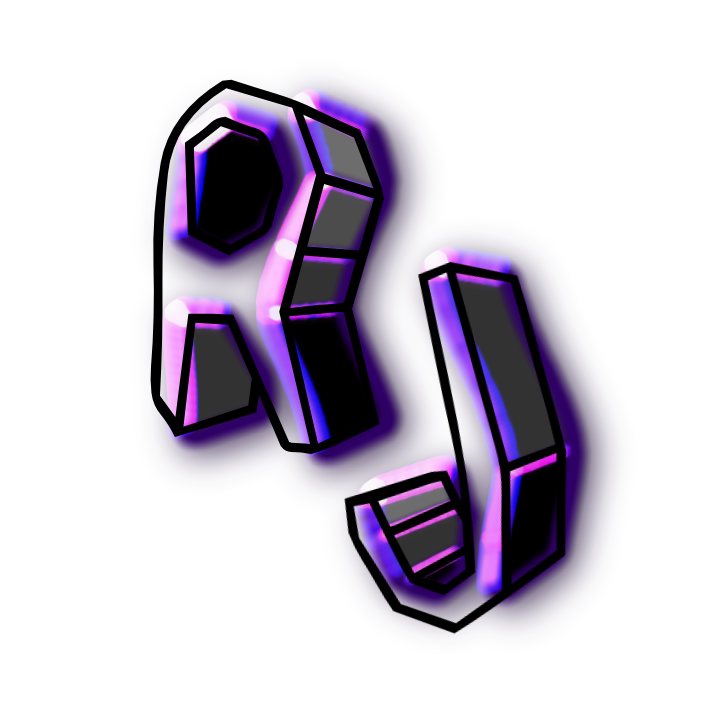

# RJelly - Dead simple and Flexible ⚡
<br/>

- Now on v3!

## This GUI Library is under early-development. 👷‍♂️
<br/>

To use this GUI Library we can start by loading it using
```lua
local RJelly = loadstring(game:HttpGet("https://raw.githubusercontent.com/someoneuk/Warehouse/refs/heads/main/Libraries/RJelly/RJellyUI.lua"))()
```
<br/>

Then we can start by making a window with
```lua
local Window = RJelly:MakeWindow("MyWindow")
```
<br/>

There! now that we got the window we can use it to create tabs, buttons, and everything else below.
<br>

First let's try creating a tab.
```lua
local Tab = Window:MakeTab("MyTab")
```
<br>

## Buttons

```lua
local Button = Tab:MakeButton("Click me!",function()
  print("do something")
end)
```
Every button now comes with its own little icon, and gives you back a module so you can mess with it later:
- `Button:SetTitle("New Text")` - change what it says
- `Button:Activate()` - click it yourself, in code
- `Button:ChangeCallback(function() ... end)` - swap out what it does
<br>

## Toggles

```lua
local Toggle = Tab:MakeToggle("Toggle",function(value)
  if value == true then
    print("Toggle on")
  else
    print("Toggle off")
  end
end)
```
> *Below might be incorrect, its kinda confusing to explain*

Toggles remember their state now, and you can read/set it whenever:
- `Toggle:GetValue()` - returns true/false
- `Toggle:SetValue(true)` - force it on/off without firing the callback
- `Toggle:SetNextActivationValue(false)` - decide what the *next* click flips it to
- `Toggle:Activate()` - flip it in code
- `Toggle:SetTitle("New Text")`
- `Toggle:ChangeCallback(function(value) ... end)`
<br>

## Text Input

```lua
local Input = Tab:MakeInput("Print ANYTHING",function(input, enterPressed)
  if enterPressed then
    print("you typed "..input.." and pressed enter!")
  else
    print("you typed "..input.." without pressing enter!")
  end
end)
```
- `Input:SetInput("hello")` - set the text box's content
- `Input:Activate(text, enterPressed)` - trigger the callback manually
- `Input:SetTitle("New Text")`
- `Input:ChangeCallback(function(input, enterPressed) ... end)`
<br>

## Dropdown

```lua
local Dropdown = Tab:MakeDropdown("Dropdown Prints")

local Option = Dropdown:AddOption("Hello",function()
  print("Hello")
end)

Dropdown:AddOption("Goodbye",function()
  print("Goodbye")
end)
```
Each option gives you back its own module too:
- `Option:Activate()` - trigger it in code
- `Option:ChangeTitle("New Text")`
- `Option:ChangeCallback(function() ... end)`
- `Option:Remove()` - delete it from the list
<br>

## Label ✨ new in v3

Just plain text, no interaction, great for headers or notes inside a tab.
```lua
local Label = Tab:MakeLabel("Section: Combat")
Label:ChangeLabel("Section: Movement")
```
<br>

## Space ✨ new in v3

An empty gap, useful for breathing room between elements.
```lua
local Space = Tab:MakeSpace(20) -- height in pixels, defaults to 30
Space:ChangeSize(40)
```
<br>

## Also new in v3
- Dragging the window now works with touch too, not just mouse - mobile friendly 📱
- Elements now show up in the order you create them, instead of shuffling alphabetically

<br>

That's all, if you're using this library then thanks for using it! 👍
<br>
you can check out my examplescript you can instantly execute here!<br>
[Example script](examplescript.lua)
